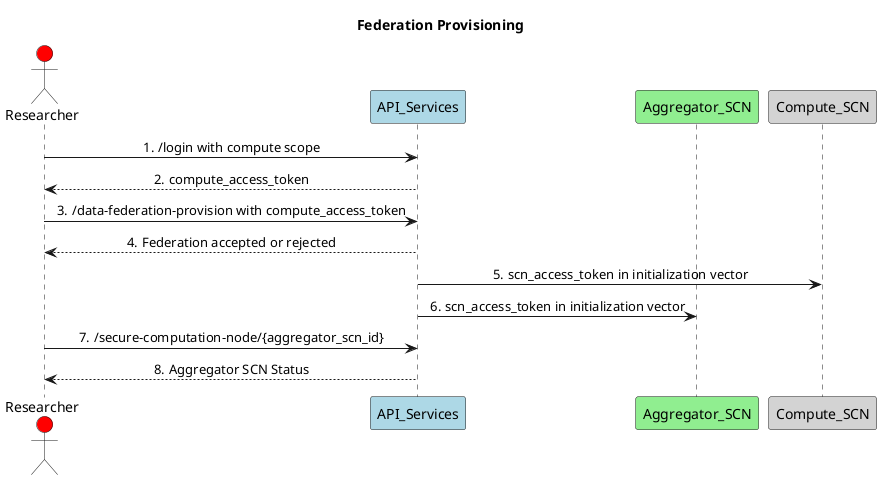
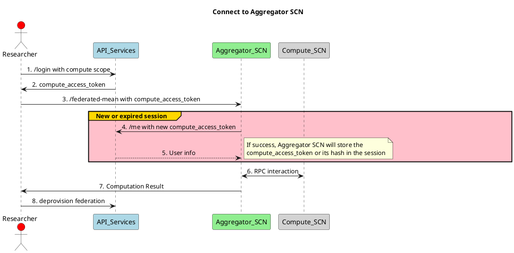

# Federation Authentication and Authorization

The Nodes provisioned for a federation need to interact with the API services with appropriate scopes and security measures. We will look at how to achieve that in this document.

# Vocabulary

* **SCN** - Secure Computation Node
* **Aggregator SCN** - The SCN that aggregates the compute resources from the other SCNs
* **Compute SCN** - The SCN that provides compute resources to the Aggregator SCN and hosts the datasets
* **Researcher** - A researcher user of the API that has a compute scope
* **API Services** - SAIL API services that provide authentication and database services

# Access Tokens scopes

## compute_access_token
Access Token with a 'compute' scope that can only make calls to the API Services from the researcher-sdk. It can only be used to:
- get the user info
- provision a federation
- get the status of a federation and its nodes
- connect and perform computations on the aggregator scn

## scn_access_token
Access Token with a 'scn' scope that can only make calls to the API Services from the secure computation nodes. It is the only scope that can be used to register audit logs to the scn or update the scn status. These tokens never expire.

# SCN Provisioning

The researcher can provision a federation by calling the API Services with a compute_access_token. The API Services will then provision the Aggregator SCN and the Compute SCN to provision the federation.

# Aggregator SCN Operations

After the provisioning of the federation, the researcher can connect to the Aggregator SCN and perform computations on the datasets hosted by the Compute SCN.

# To be decided
- Do we need to revoke access for a compute session ?
