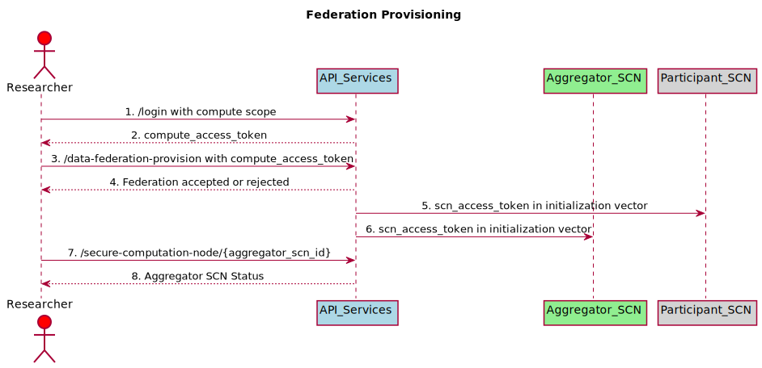

# Federation Authentication and Authorization

The Nodes provisioned for a federation need to interact with the API services with appropriate scopes and security measures. We will look at how to achieve that in this document.

# Vocabulary

* **SCN** - Secure Computation Node
* **Aggregator SCN** - The SCN that aggregates the compute resources from the other SCNs
* **Participant SCN** - The SCN that provides compute resources to the Aggregator SCN and hosts the datasets
* **Researcher** - A researcher user of the API that has a compute scope
* **API Services** - SAIL API services that provide authentication and database services

# Access Tokens scopes

## compute_access_token
Access Token with a 'compute' scope that can only make calls to the API Services from the researcher-sdk. It can only be used to:
- get the user info
- provision a federation
- get the status of a federation and its nodes
- connect and perform computations on the aggregator scn

## scn_access_token
Access Token with a 'scn' scope that can only make calls to the API Services from the secure computation nodes. It is the only scope that can be used to register audit logs to the scn or update the scn status. These tokens never expire.

# SCN Provisioning

The researcher can provision a federation by calling the API Services with a compute_access_token. The API Services will then provision the Aggregator SCN and the Participant SCN to provision the federation.

```plantuml
@startuml Federation_Provisioning
autonumber "#."
title  Federation Provisioning
skinparam backgroundColor #EEEEEE
skinparam sequenceMessageAlign center
actor Researcher #red
participant API_Services #LightBlue
participant Aggregator_SCN #LightGreen
participant Participant_SCN #LightGrey

Researcher -> API_Services : /login with compute scope

API_Services --> Researcher : compute_access_token

Researcher -> API_Services : /data-federation-provision with compute_access_token

Researcher <-- API_Services : Federation accepted or rejected

API_Services -> Participant_SCN : scn_access_token in initialization vector

API_Services -> Aggregator_SCN : scn_access_token in initialization vector

Researcher -> API_Services : /secure-computation-node/{aggregator_scn_id}

API_Services --> Researcher : Aggregator SCN Status

@enduml
```

# Aggregator SCN Operations

After the provisioning of the federation, the researcher can connect to the Aggregator SCN and perform computations on the datasets hosted by the Participant SCN.

```plantuml
@startuml Connect_to_Aggregator_SCN
autonumber "#."
title Connect to Aggregator SCN
skinparam backgroundColor #EEEEEE
skinparam sequenceMessageAlign center
actor Researcher #red
participant API_Services #LightBlue
participant Aggregator_SCN #LightGreen
participant Participant_SCN #LightGrey

Researcher -> API_Services : /login with compute scope

API_Services -> Researcher : compute_access_token

Researcher -> Aggregator_SCN : /federated-mean with compute_access_token
group#Gold #Pink New or expired session
    Aggregator_SCN -> API_Services : /me with new compute_access_token

    API_Services --> Aggregator_SCN : User info
    note right
        validates the user is a researcher
    end note
    note right
        If success, Aggregator SCN will store the
        compute_access_token or its hash in the session
    end note
end

Aggregator_SCN <-> Participant_SCN : RPC interaction

Researcher <- Aggregator_SCN : Computation Result

Researcher -> API_Services : deprovision federation

@enduml
```

# To be decided
- Do we need to revoke access for a compute session ?
