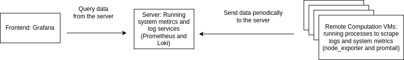

# Survelliance deploy tool

## Dependencies
The deployment script requires external library. To install, run:

```
sudo pip3 -r requirement.txt
```

To view the survelliance data, one can directly visit:

```
20.121.7.234:3100 (for log data)

20.121.7.234:9090 (for system metrics)
```

But a better way is to use grafana, which is a datadash board frontend.
The latest grafana version has some bugs which have not been fixed, thus it is better to use an old version 8.2.5

To install grafana, one can refer to:

https://grafana.com/docs/grafana/latest/installation/

If you are using Ubuntu linux OS, One can run the following command to install:

```
wget https://dl.grafana.com/enterprise/release/grafana-enterprise_8.2.5_amd64.deb

sudo dpkg -i grafana-enterprise_8.2.5_amd64.deb
```

To run grafana:
```
sudo systemctl daemon-reload
sudo systemctl start grafana-server
```
Then one should be able to access the dashboard on localhost:3000

To shutdown the grafana service:
```
sudo systemctl stop grafana-server
```

## Use
To use the tool, run the deploy script with the following command:
```
python deploy.py -i {ips} -u {username} -p {password} -s {prometheus server ip} -c {promtail config file template}
```
A ready prometheus server is running on ip: 20.121.7.234.

The promtail config file template is in this repo: promtail-local-config.yaml

The username and password are to use for login to the remote VM by SSH.

The ips are ips for remote VMs, separeated by space.

An example command:
```
python deploy.py -i 1.1.1.1 2.2.2.2 3.3.3.3 -u saildeveloper -p aaa -s 20.121.7.234 -c promtail-local-config.yaml
```
This will deploy survelliance service to three VMs at address 1.1.1.1, 2.2.2.2 and 3.3.3.3

Once the deploy succeed, one can use grafana to view the survelliance metrics and logs. To setup grafana, the first step is to add data source.

https://grafana.com/docs/grafana/latest/datasources/add-a-data-source/

We need two different kinds of data source here:

Loki (for logs)

Prometheus (for system metrics)

After select loki, one need to change the URL to 20.121.7.234:3100 on the configuration page. Then by click save and test, one should be able to confirm it is working normally

The configuration for prometheus is the same, just need to change the URL to 20.121.7.234:9090

Then one need to go to **create->import** to import template ID 1860 for the node_exporter, which is a dashboard template frontend for us to get a better view on system metrics data.

After import, one can find the dashboard under **search dashboards**

To view the logs, go to **explore** and select loki. One should be able to query the logs by the log browser.

## General Background
The data flow of the survelliance system depicted by the following diagram



There are two processes running on each computation virtual machine, scraping logs and system metrics, sending results periodically to a server. The server will store the submitted data into a time-series database, and when a request arrived from the frontend, the server sends back the data based on the query command.
